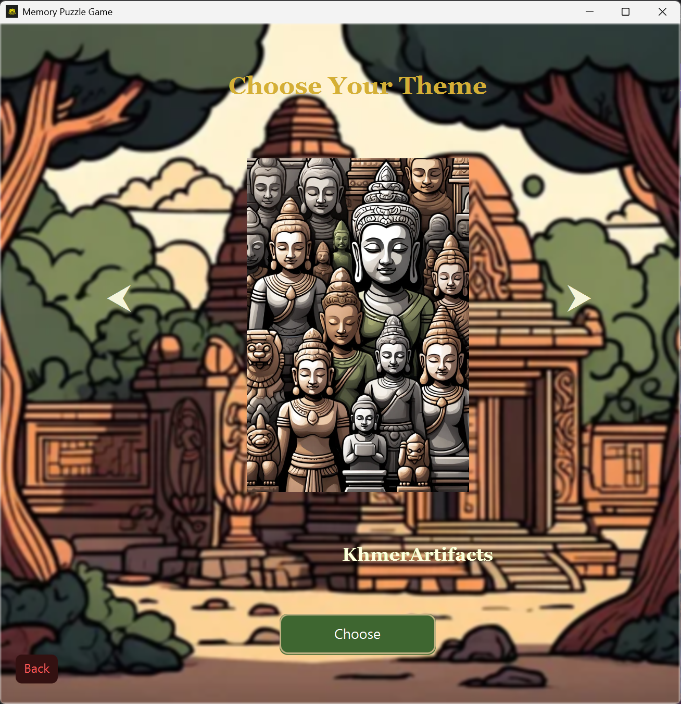
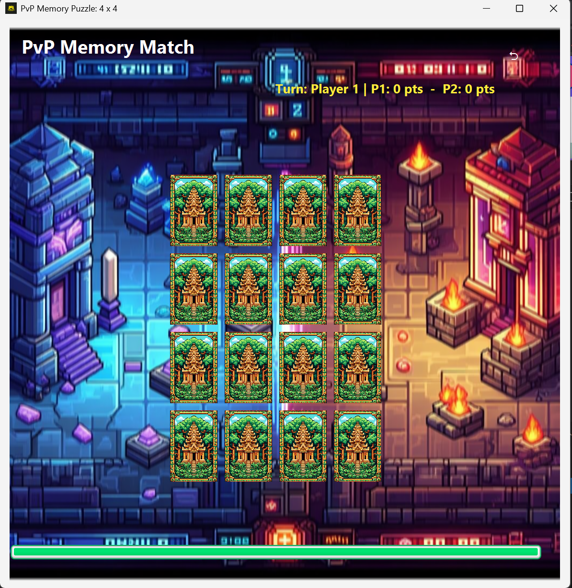

# 🧠 Puzzle Memory Game

A Game where you have to match all the pairs of cards before the time runs  and each level has a different grid size and difficulty.
built with JavaFX, FXML, CSS, and SQLite with mvc architecture

##To Run This Game
**Run on Terminal**
<pre>java --module-path javafx_sdk/lib --add-modules javafx.controls,javafx.fxml,javafx.media `
-cp "out;lib/sqlite-jdbc-3.50.1.0.jar;lib/gson-2.10.1.jar" `
application.Main </pre>

**or Click run or F5 **

## 🎮 Features

### 👤 Authentication
- **Register/Login system** with:
  - Username (min 6 characters)
  - Password (min 6 characters, at least 1 special character, no spaces)
  - Passwords securely hashed with **SHA-256**

### 🏠 Home Screen
- Background music with toggle and volume control
- Buttons: `Play`, `Play with Friend (PvP)`, `Shop`, `Leaderboard`, `Profile`

### 🧩 Game Modes
- **Single Player**: Choose themes like Artifacts, Fruits, etc.
- **PvP (Offline)**: Player 1 vs Player 2, turn-based memory challenge
- Levels with unique configurations:
  - Grid sizes (e.g., 4x4, 5x6, 6x7)
  - Time limits, score multipliers, and flip animations

### 💰 Shop
- Purchase hints using coins
- Earn coins by winning levels and completing achievements

### 📊 Leaderboard
- View top players ranked by:
  - Best score
  - Win rate
  - Longest correct flip streak

### 🧑 Profile
- View and edit:
  - Username
  - Profile picture
- View stats:
  - Coins, highest score, number of hints
  - Levels completed, win/loss rate, best streak

### 🗂️ Game History
- View history of completed levels:
  - Score, bonus, final score, stars, time taken, win/loss

### 🕹 Gameplay
- Animated card flips
- Swap mechanics for advanced levels
- Peek feature at the start
- Hint usage during gameplay
- Time-based final score multiplier
- Bonus system for correct streaks

---

## 🛠 Built With

- **JavaFX** — UI rendering
- **FXML** — UI layout
- **CSS** — Styling and animations
- **SQLite** — Data persistence
- **GSON** — Level configurations

---
## 🖼️ UI 

## Authentication Screen

### Home Screen

### Profile

### Shop

### Leaderboard

### Option Screen

### Level Screen

### Game Play

### Win or Lose

### PVP or Play with friends (offline)

